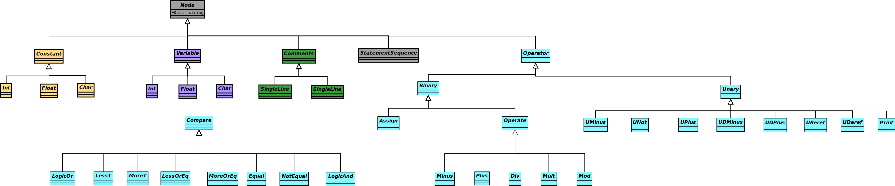
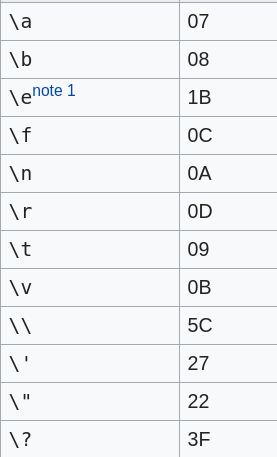

# Compilers
## Auteurs
Arno Deceuninck & Basil Rommens
## Quickstart
```run.sh``` for running ```main.py``` with ```test.c```

```test.sh``` for running unittests
## Opgave
### 1. Expressions
#### Mandatory
- [x] Binary operations +, -, * and /
- [x] Binary operations >, < and ==
- [x] Unary operators + and -
- [x] Brackets to overwrite the order of operations
- [x] AST
#### Optional
- [x] Binary operator %
- [x] Comparison operators >=, <=, and !=
- [x] Logical operators &&, ||, and !


### 2. Variables
#### Mandatory
- [x] Types (char, float, int and pointer)
- [x] Reserved words (const)
- [x] Variables
- [x] AST

#### Optional
- [ ] Identifier operations (++ and --)
- [ ] Conversions


### 3. LLVM
#### Mandatory
- [x] Comments (single line and multiline)
- [x] Printf
- [x] LLVM generation (niet mogelijk om pointers te gebruiken)

#### Optional
- [ ] Retaining comments in compilation process
- [x] Comment after every instruction that contains the statement from the input code


### 4. Loops and conditionals
#### Mandatory
- [x] Reserved words: If
- [x] Reserved words: Else
- [x] Reserved words: While
- [x] Reserved words: For
- [x] Reserved words: Break
- [x] Reserved words: Continue
- [x] Scopes: unnamed scopes
- [x] Scopes: Loops
- [x] Scopes: Conditionals

#### Optional
- [ ] Reserved words: Switch
- [ ] Reserved words: Case
- [ ] Reserved words: Default


### 5. Functions
#### Mandatory
- [x] Reserved words: return
- [x] Reserved words: void
- [x] Scopes: function
- [x] Local and global variables
- [x] Functions
- [x] Do not generate code after return statement
- [x] Do not generate code after break or continue

#### Optional
- [ ] Do not generate code for variables that are not used
- [ ] Do not generate code for conditionals that are always false
- [ ] Check if all functions end with return

### 6. Arrays
#### Mandatory
- [ ] Arrays
- [x] Import: printf(char *format, ...)
- [x] Import: intf(const char *format, ...)

#### Optional
- [ ] Arrays: Multi-dimensional
- [ ] Arrays: assignments of complete arrays or array rows in case of multi-dimensional arrays
- [ ] Arrays: Dynamic arrays

## LLVM Generatie
Om llvm leesbaar te houden voor ons en het eenvoudig te houden in presentatie, maken we gebruik van verschillende middelen.
### Variabelen
Voor de llvm generatie van variabelen zorgen we er voor dat er geen overlap gebeurt tussen de variabelen op de volgende manier.
Het **eerste** wat we doen is **globale variabelen** hun gewone naam laten houden _(<var_name>)_. **Andere variabelen** worden anders behandeld.
Indien we deze tegenkomen nemen we de variabele naam en plakken we achter de variabele een . en dan nog de id van de node waar ze
in zitten _(<var_name> + . + <node_id>)_. Het punt dient er voor dat variabelen niet met een getal kunnen overeenkomen als we dit op een of andere manier proberen te bereiken.
Het punt kan je niet in c gebruiken bij een variabele naam. Dan hebben we de **automatisch gegenereerde variabelen** die beginnen altijd
met een punt en worden gevolgd door een letter, dit kan een _v_ of een _t_ zijn. _v_ wijst op een variabele die wordt later meestal gebruikt, terwijl t wijst 
op een tijdelijke variabele, deze is altijd anders wanneer men die genereerd van een node. Na deze letter volgt een unieke id
bij een _t_ is die bij elke generatie anders, maar bij een _v_ is die gelijk aan de id van de node zo blijft deze variabele herbruikbaard _(. + t|v + <id>)_.
Tot slot hebben we nog de strings die er gebruikt worden in `printf` en `scanf`. Deze zijn van de volgende structuur (. + str + . + <node_id>).
### Comentaren
We zorgen er ook voor dat er bij de llvm generatie commentaren bij komen, dit zorgt er grotendeels voor dat we de snel kunnen terugvinden
waar we eventueel een fout in hebben gemaakt. Ook worden code blokken aangeduid, let wel op dat dit niet enorm betrouwbaar is.
Het enigste waar we in commentaren generatie in verschillen is dat deze voor de llvm statements gebeurd.

## MIPS generatie
Om mips te genereren vertrekken we vanuit llvm. Zo kunnen we veel dubbel werk vermijden, zoals het bepalen van scopes,
variabelen toekennen enz.
### Variabelen
We slaan al de variabelen op in de stack. We zoeken eerst al de gebruikte variablen in de llvm code en bepalen dan hoe groot
de stack moet zijn. Omdat er geen enkele variabele overlap heeft ook niet met functies, kunnen we de stackpointer relatief klein houden.
Zo moeten we geen rekening houden met de variabelen die reeds gebruikt zijn, met de doorgegeven argumenten is er een speciale operatie nodig, net als al de variabelen
in de functie, die moeten ook opgeslagen worden. Dit gebeurd met de stackpointer

## Opmerkingen
Indien er een bewerking wordt gedaan op 2 integer getallen, wordt de uitkomst afgerond en omgezet naar een int

## Node klasse
### Structuur


### Histogram
-  Constanten
-  Operatoren
-  Variabelen
-  Gereserveeerde types
-  Functies en argumentenlijst
-  Commentaren
-  Include
-  Default Nodes

## Escape Sequences
Omdat het ridicuul zou zijn om elke mogelijke escape sequence van c te implementeren, hebben we er slechts eensubset van geimplementeerd. Deze subset is in de afbeelding hieronder afgebeeld.


## Testen
In de tests folder vind je een bestand ```test.py```. Als je dit runt, runnen er ineens een paar testen. De uitleg waarvoor
welke test specifiek dient kan je terugvinden in het c bestand van de test zelf (in de folder ```tests/input```). Om specifiek te weten waarop de testen werken, kan je een kijkje nemen in het ```tests/test.py```. 

## Benchmark Result
### CorrectCode (21/32)
#### Code with arrays (6/32)
All these files do not work right now:
- scanf2.c
- scoping.c
- unaryOperations.c
- variables3.c
- variables7.c
- variables8.c
#### Other files (5/32)
Did not know that double pointers needed to work. Scoping does not work. The first 2 compares give some weird result because own implementation
see video. And strings passed as arguments in printf.
- comparisons1.c
- comparisons2.c
- intToFloatConversion.c
- printf2.c
- variables6.c
### SemanticErrors (17/47)
Skipped all array files

#### Undetected semantic errors:
- declarationDeclarationMismatch1.c
- declarationDeclarationMismatch2.c
- declarationDeclarationMismatch3.c
- declarationDefinitionMismatch1.c
- declarationDefinitionMismatch2.c
- declarationDefinitionMismatch3.c
- definitionInLocalScope.c
- functionCallargumentMismatch1.c
- functionCallargumentMismatch2.c
- functionCallargumentMismatch3.c
Note: Not sure about everything above this line whether it's undetected or uncaught
- functionCallargumentMismatch4.c
- incompatibleTypes6.c
- mainNotFound.c
- returnTypeMismatch.c

####Wrong error:
None

####Uncaught errors (much red in Python): 
!!! Every file with an empty main
- functionRedefinition1.c
- functionRedefinition2.c
- functionRedefinition3.c
- incompatibleTypes7.c

####Works as they should:
- dereferenceTypeMismatch1.c
- dereferenceTypeMismatch2.c
- incompatibleTypes1.c
- incompatibleTypes2.c
- incompatibleTypes3.c
- incompatibleTypes4.c
- incompatibleTypes5.c
- invalidIncludeError.c
- invalidLoopControlStatement.c
- parameterRedefinition1.c
- parameterRedefinition2.c
- parameterRedefinition3.c
- pointerOperationError.c
- returnOutsideFunction.c
- undeclaredFunction.c
- undeclaredVariable1.c
- undeclaredVariable2.c
- undeclaredVariable3.c
- variableRedefinition1.c
- variableRedefinition2.c
- variableRedefinition3.c
- variableRedefinition4.c
- variableRedefinition5.c
- variableRedefinition6.c 

####Unsupported:
- All array files
- invalidUnaryOperation.c

###MIPS tests
- [ ] binaryOperations1.c
- [x] binaryOperations2.c
- [x] breakAndContinue.c
- [ ] comparisons1.c
- [ ] comparisons2.c
- [x] dereferenceAssignment.c
- [x] fibonacciRecursive.c
- [ ] floatToIntConversion.c
- [x] for.c
- [x] forwardDeclaration.c
- [x] if.c
- [x] ifElse.c
- [ ] intToFloatConversion.c
- [x] modulo.c
- [ ] pointerArgument.c
- [x] prime.c
- [x] printf1.c
- [x] printf2.c
- [ ] printf3.c
- [ ] scanf1.c (passes because manual input required)
- [ ] scanf2.c (passes because manual input required)
- [ ] scoping.c
- [ ] unaryOperations.c
- [ ] variables1.c
- [ ] variables2.c
- [ ] variables3.c
- [x] variables4.c
- [x] variables5.c
- [x] variables6.c
- [ ] variables7.c
- [ ] variables8.c
- [x] while.c
