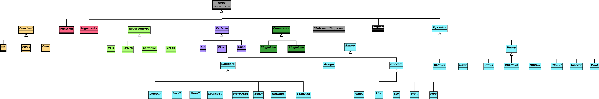

# Compilers
## Auteurs
Arno Deceuninck & Basil Rommens
## Quickstart
```run.sh``` for running ```main.py``` with ```test.c```

```test.sh``` for running unittests
## Opgave
### 1. Expressions
#### Mandatory
- [x] Binary operations +, -, * and /
- [x] Binary operations >, < and ==
- [x] Unary operators + and -
- [x] Brackets to overwrite the order of operations
- [x] AST
#### Optional
- [x] Binary operator %
- [x] Comparison operators >=, <=, and !=
- [x] Logical operators &&, ||, and !


### 2. Variables
#### Mandatory
- [x] Types (char, float, int and pointer)
- [x] Reserved words (const)
- [x] Variables
- [x] AST

#### Optional
- [ ] Identifier operations (++ and --)
- [ ] Conversions


### 3. LLVM
#### Mandatory
- [x] Comments (single line and multiline)
- [x] Printf
- [x] LLVM generation (niet mogelijk om pointers te gebruiken)

#### Optional
- [ ] Retaining comments in compilation process
- [ ] Comment after every instruction that contains the statement from the input code


### 4. Loops and conditionals
#### Mandatory
- [x] Reserved words: If
- [x] Reserved words: Else
- [x] Reserved words: While
- [x] Reserved words: For
- [x] Reserved words: Break
- [x] Reserved words: Continue
- [x] Scopes: unnamed scopes
- [ ] Scopes: Loops
- [x] Scopes: Conditionals

#### Optional
- [ ] Reserved words: Switch
- [ ] Reserved words: Case
- [ ] Reserved words: Default


### 5. Functions
#### Mandatory
- [ ] Reserved words: return
- [ ] Reserved words: void
- [ ] Scopes: function
- [ ] Local and global variables
- [ ] Functions


### 6. Arrays
#### Mandatory
- [ ] Arrays
- [ ] Import: printf(char *format, ...)
- [ ] Import: intf(const char *format, ...)

#### Optional
- [ ] Arrays: Multi-dimensional
- [ ] Arrays: assignments of complete arrays or array rows in case of multi-dimensional arrays
- [ ] Arrays: Dynamic arrays


## Opmerkingen
Indien er een bewerking wordt gedaan op 2 integer getallen, wordt de uitkomst afgerond en omgezet naar een int

## Node klasse
### Structuur


### Histogram
-  Constanten
-  Operatoren
-  Variabelen
-  Default Nodes

## Testen
In de tests folder vind je een bestand ```test.py```. Als je dit runt, runnen er ineens een paar testen. De uitleg waarvoor
welke test specifiek dient kan je terugvinden in het c bestand van de test zelf (in de folder ```tests/input```). Om specifiek te weten waarop de testen werken, kan je een kijkje nemen in het ```tests/test.py```. 